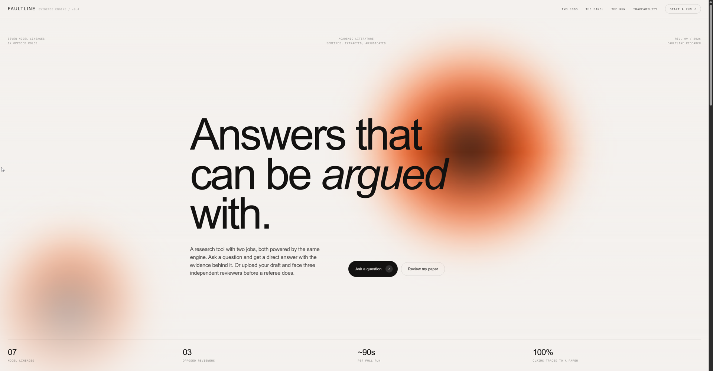
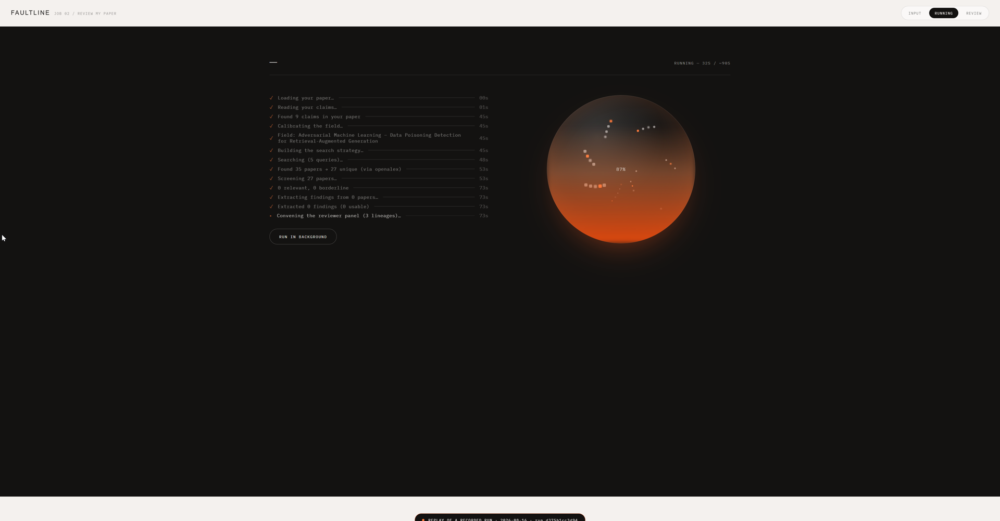
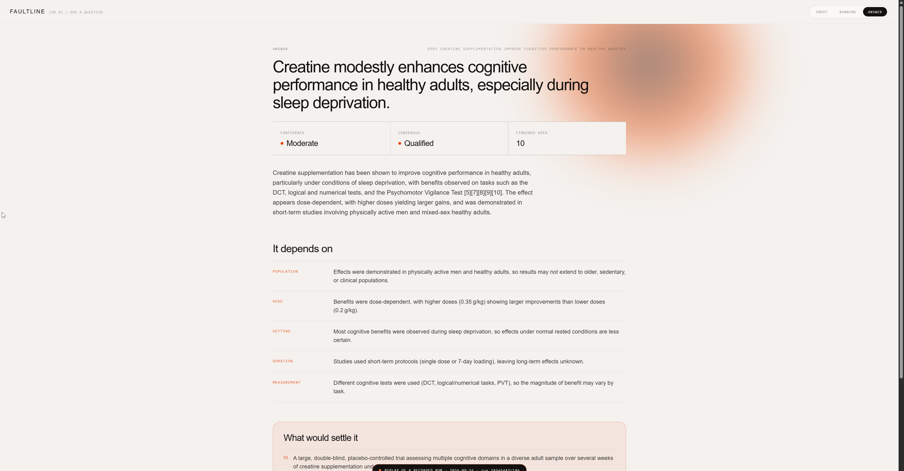
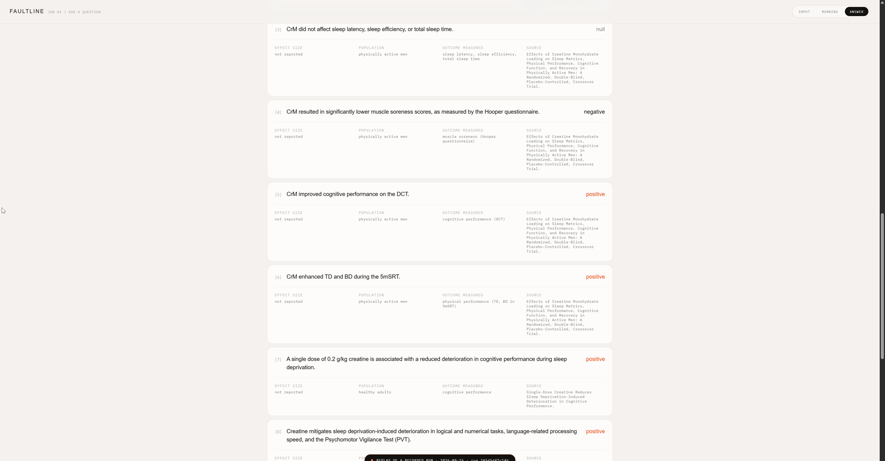
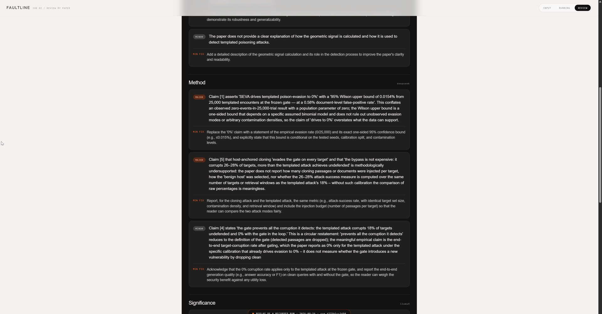

# Faultline

**Two jobs on one engine. Ask a question and get an answer from the literature.
Or hand it your draft and face three independent reviewers before a real referee
does.**

Built for **Research Agents Hack: Build Multi-Agent AI Systems (IIT Madras)** ·
Track: **Literature Review & Synthesis**

**[Live demo](https://faultline-6hlo.onrender.com/)** ·
[Submission copy](docs/SUBMISSION_COPY.md) ·
[Deployment](docs/DEPLOY.md)



---

## The problem

Researchers cannot reliably review their own work. After months on a paper you
stop seeing its weaknesses. A referee does not.

And a chat model asked about a literature returns a confident paragraph and a
handful of papers, with no way to know what it missed, whether the citations are
real, or where the evidence disagrees.

Both failures share a root: one model, one perspective, no denominator.

---

## Job 01 — Answer a question from the literature

Searches **OpenAlex, Crossref, Europe PMC and arXiv concurrently**, screens
every result for relevance, extracts each study's findings with their
qualifiers, and answers.

The answer carries confidence and consensus **reported separately**, the
conditions that change it — each tagged with the axis it moves on — where
studies disagree, and the full retrieval funnel.

<sub>Measured — *"Does creatine supplementation improve cognitive performance in
healthy adults?"* · [`demo/question.json`](demo/question.json) ·
run&nbsp;`245d5d47c14b`</sub>

| | |
|---|---|
| Answer | Modest improvement, especially during sleep deprivation |
| Confidence / consensus | Moderate / qualified |
| Conditions surfaced | 5, across 5 axes |
| Databases | Crossref, Europe PMC, OpenAlex |
| 44s · 20 model calls · 95% local | **$0.00** |

## Job 02 — Review your paper

Extracts your claims, identifies the field, retrieves the surrounding
literature, then runs **three reviewers on three model lineages** attacking
framing, method and significance. Every objection ships with the minimum change
that would neutralise it.

<sub>Measured — SEVA, a real unsubmitted paper on corpus-poisoning detection in
RAG being prepared for IEEE TDSC · [`demo/seva.json`](demo/seva.json) ·
run&nbsp;`d375b1cc3d94`</sub>

| | |
|---|---|
| Read | 10,867 words → 9 empirical claims |
| Field identified | Adversarial ML — poisoning detection for RAG (unprompted) |
| Objections | 6 major, 9 total, across 3 lineages |
| 113s · 34 model calls · 82% local | **$0.00** |

Three of what it raised:

- The 0% poison-evasion claim reports a 95% Wilson upper bound **without a base
  rate** — without which the bound does not mean what it appears to.
- *"The gate prevents all the corruption it detects"* is **circular by
  construction**.
- The paper calls itself **"LLM-free"** while depending on pretrained embedding
  models.

None appeared in the authors' own limitations section.

---

## What it looks like

Named stages report as they complete, and a database going down surfaces as a
warning rather than a failure.



The answer, with confidence and consensus reported separately and the
conditions that change it tagged by axis.



Every finding carries its direction, population, outcome measure and the paper
it came from. This is what "traceable" means concretely.



The reviewer panel. Each reviewer runs on a different model lineage, and every
objection ships with the minimum change that would neutralise it.



<sub>More: [two jobs](docs/screenshots/02-two-jobs.png) ·
[review summary](docs/screenshots/06-review.png)</sub>

---

## Why separate model families

Three prompts against one model produce three flavours of the **same blind
spot**. Separate training lineages genuinely disagree about what counts as a
problem, which is what a real review panel does.

Seven lineages run in opposed roles:

| Role | Lineage | Where it runs |
|---|---|---|
| R1 framing | Nemotron | OpenRouter |
| R2 method | DeepSeek V4 | OpenRouter |
| R3 significance | Llama 4 | OpenRouter |
| Adjudication, field calibration | gpt-oss | Groq |
| Comparability — opposed pair | Mistral vs Llama 3 | Ollama / Groq |
| Screening, extraction, query expansion | Qwen 3 | Ollama, local |

An earlier version gave each assessor a *stance to argue*, then read the
resulting disagreement as independent judgement. That is measurement error, not
evidence, and it produced a meaningless 100% disagreement rate. Assessors now
get the same neutral prompt and differ only by lineage. Disagreement fell to
**17%** — a number that means something.

---

## Honesty as a design constraint

- **Every claim traces to a specific paper.** Findings display the source title.
- **The denominator is shown, not hidden** — retrieved, unique, screened,
  included, borderline, excluded.
- **When the evidence does not settle a question, it says so** rather than
  manufacturing confidence.
- **Degradation is visible.** A rate-limited database surfaces as a banner while
  the run continues.
- **Recorded demo runs are labelled as replays on screen**, carrying their
  original run id and date. A replay presented as live would be a lie.

---

## Run it

Requires Python 3.13+ and [Ollama](https://ollama.com) for local inference.

```bash
pip install -r requirements.txt
```

```bash
ollama pull qwen3:8b && ollama pull mistral:7b-instruct
```

Copy `.env.example` to `.env` and add free keys from
[Groq](https://console.groq.com) and [OpenRouter](https://openrouter.ai):

```bash
GROQ_API_KEY=...
OPENROUTER_API_KEY=...
POLITE_POOL_EMAIL=you@example.com
```

```bash
python -m uvicorn server:app --port 8000
```

Then open `http://localhost:8000` — landing, `/ask`, `/review`.

### Without a GPU

`FAULTLINE_HOSTED_ONLY=1` remaps the local roles onto hosted models. It works,
but screening issues one call per retrieved paper, so large runs meet free-tier
limits. `FAULTLINE_PUBLIC_DEMO=1` serves the recorded runs only and needs no
keys — that is what the live link runs. See [docs/DEPLOY.md](docs/DEPLOY.md).

---

## Layout

```
faultline/           the engine
  agents/            framing, screening, extraction, review, answer
  retrieval/         OpenAlex, Crossref, Europe PMC, arXiv
  store/             SQLite trace, cache, claim record
  graph.py           LangGraph state graph
  payload.py         dataclasses -> the JSON the pages render
server.py            FastAPI: jobs, replays, static pages
web/                 landing, ask, review + the demo autopilot
demo/                recorded runs, narration, cue sheet
scripts/             record_demo, capture_demo, make_subtitles, build_static
evaluation/          results measured against published reviews
```

---

## Known limits

Stated because a tool that hides these is not one you should trust.

- **Retrieval recall is the weak point.** Citation snowballing is not
  implemented, so the corpus is whatever four databases return for the
  generated queries.
- **Abstract-first.** Full-text acquisition is not built; extraction works from
  abstracts and any full text supplied directly.
- **Hosted-only deployment degrades** under free-tier rate limits. The design
  pays off locally.

---

Built by **V Varadharajan** and **A Sowmiya Priya**, SRM Ramapuram, Chennai.

*Ask the literature. Or let the literature review you.*
